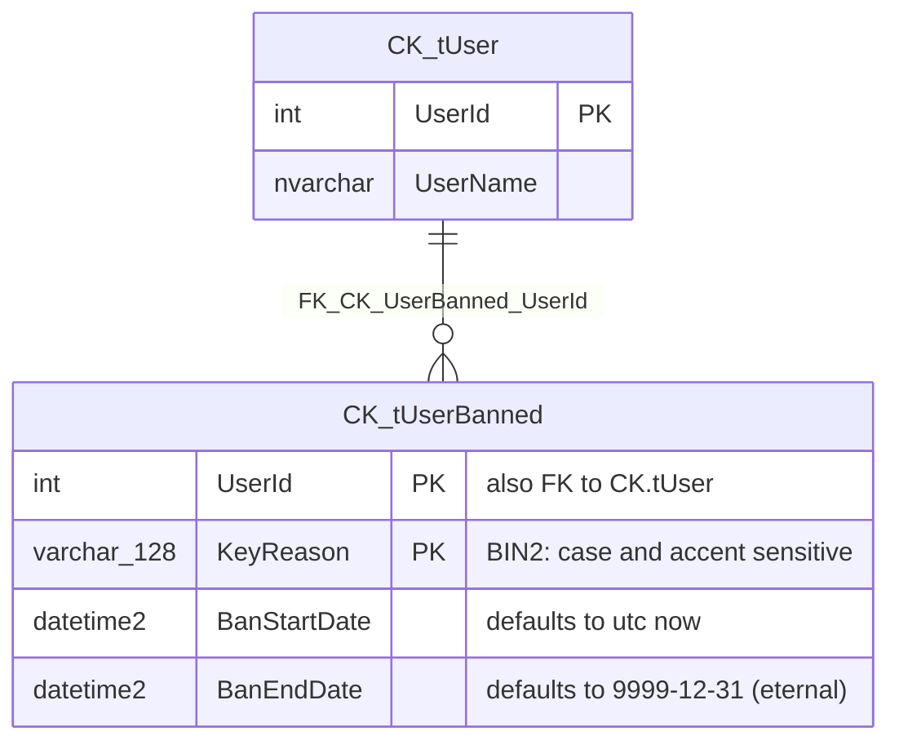

# CK.DB.User.UserBanned

This package is based on **CK.DB.Auth** that introduces User and authentication.

It adds UserBanned to the picture: a user present in the UserBanned table has been banned.

## The relational model.



`CK.tUser` belongs to [CK.DB.Actor](https://github.com/signature-opensource/CK-DB/tree/develop/CK.DB.Actor#readme)
and is shown here only as the target of the foreign key and as the source of `UserName` for the view
below.

The table [CK.tUserBanned](Res/Model.CK.UserBannedTable.Install.1.0.0.sql) accepts many bans for one
user, with different reasons. **The unicity of a banishment is based on the couple
(UserId, KeyReason)** - that couple is the primary key. A `check` constraint also enforces
`BanStartDate <= BanEndDate`, so an inverted interval is rejected by the database rather than silently
producing a ban that never applies.

Note that `KeyReason` uses the `Latin1_General_100_BIN2` collation: reasons are compared **byte by
byte**, so `"TooManyAttempt"` and `"toomanyattempt"` are two distinct banishments.

## A ban is an interval, and "currently banned" is computed, never stored.

There is no `IsBanned` flag. Whether a user is banned is always evaluated against a date, and the two
SQL objects that do it are the only supported way to read the table:

- [`CK.fUserBannedViewAt( @Date )`](Res/fUserBannedViewAt.sql) is an inline table-valued function
  returning the banishments effective at the given date - the half-open interval
  `BanStartDate <= @Date and @Date < BanEndDate`. The end date is **excluded**, which is what makes
  `BanEndDate = BanStartDate` mean "not banned" rather than "banned for an instant".
- [`CK.vUserCurrentlyBanned`](Res/vUserCurrentlyBanned.sql) applies that function to
  `sysutcdatetime()` and joins `CK.tUser` to add the user name:

```sql
select UserId, KeyReason, UserName, BanStartDate, BanEndDate
from CK.vUserCurrentlyBanned;
```

Querying `CK.tUserBanned` directly would return expired and future banishments as if they were
active. Use the function when you need a date, the view when you mean now.

## Setting and destroying a banishment.

A user banishment can be set and destroyed thanks to the [`UserBannedTable`](UserBannedTable.cs)
methods:

```csharp
/// <summary>
/// Creates or updates a user banishment between the specified dates.
/// <para>
/// If <paramref name="banStartDate"/> is <see langword="null"/> and the user is already ban then the start date will be the same, else it will be utc now.
/// </para>
/// If <paramref name="banEndDate"/> is <see langword="null"/> it will be eternal (9999-12-31).
/// </summary>
/// <param name="ctx">The call context.</param>
/// <param name="actorId">The identifier of the actor who bans the user.</param>
/// <param name="keyReason">The reason of the banishment.</param>
/// <param name="userId">The identifier of the user to ban.</param>
/// <param name="banStartDate">The start date of the banishment, default is utc now.</param>
/// <param name="banEndDate">The end date of the banishment, default is eternal.</param>
[SqlProcedure( "sUserBannedSet" )]
public abstract void SetUserBanned( ISqlCallContext ctx, int actorId, string keyReason, int userId, DateTime? banStartDate = null, DateTime? banEndDate = null );

/// <summary>
/// Destroys the user banishment.
/// </summary>
/// <param name="ctx">The call context.</param>
/// <param name="actorId">The identifier of the actor who destroy the banishment.</param>
/// <param name="keyReason">The reason of the banishment.</param>
/// <param name="userId">The identifier of the user to unbanned.</param>
[SqlProcedure( "sUserBannedDestroy" )]
public abstract void DestroyUserBanned( ISqlCallContext ctx, int actorId, string keyReason, int userId );
```

Both have an `Async` counterpart. On top of them, a duration-based overload is provided in C# only -
it is a plain helper that computes the end date and rejects a negative `TimeSpan` with
`ArgumentOutOfRangeException`:

```csharp
public void SetUserBanned( ISqlCallContext ctx, int actorId, string keyReason, int userId, DateTime banStartDate, TimeSpan duration )
```

`SetUserBanned` is an upsert: on an existing (UserId, KeyReason) it updates the dates. Two asymmetries
of [`sUserBannedSet`](Res/sUserBannedSet.sql) are worth knowing:

- Passing `banEndDate = null` on an **existing** banishment does not keep the current end date, it
  resets it to eternal (`IsNull(@BanEndDate, '9999-12-31')`), whereas `banStartDate = null` does keep
  the existing start date. Pass the end date explicitly when you extend a ban.
- The existence test and the update match with `KeyReason like @KeyReason`, while
  [`sUserBannedDestroy`](Res/sUserBannedDestroy.sql) matches with `=`. A reason containing `%` or `_`
  therefore behaves differently on set and on destroy. Keep reasons to plain identifiers such as
  `"UserPassword.TooManyAttempt"`.

## Who is allowed to ban.

The security is enforced in SQL, not in C#, so it holds whatever the caller is:

- `@ActorId <= 0` is rejected (`Security.AnonymousNotAllowed`); an empty reason and a non-positive
  user identifier are rejected too.
- **A member of the System group (`GroupId = 1`) cannot be banned** - `sUserBannedSet` throws
  `Security.CannotBanSystemGroupMember`. Note that this is a `throw`, not a silent no-op: any caller
  that may target an administrator has to handle the exception - including a caller that invokes this
  procedure from inside another one, where the exception propagates out of the whole statement.
- By default **only a member of the System group can ban or unban**, otherwise
  `Security.AdminOnly` is thrown.

That default is a policy, not an invariant. Both procedures expose an extension point that runs right
before the final check, so a consuming package can transform them to widen or harden the rule:

```sql
    declare @CanContinue bit = 0;
    if exists( select 1 from CK.tActorProfile where GroupId = 1 and ActorId = @ActorId )
        set @CanContinue = 1;

    -- Extension point: a consuming package can transform this procedure to inject SQL here
    -- that adjusts @CanContinue (to re-open or to harden the access) before the final check.
    --<BannedSecurityCheck revert />

    if @CanContinue = 0 throw 50000, 'Security.AdminOnly', 1;
```

The destroy procedure has the same shape with `--<DestroySecurityCheck revert />`. Besides those two
security hooks, each procedure carries its own action markers - and only its own:

| Procedure | Markers |
|-----------|---------|
| [`sUserBannedSet`](Res/sUserBannedSet.sql) | `--<BannedSecurityCheck revert />`, `--<PreCreate revert />` / `--<PostCreate />` (new banishment), `--<PreUpdate revert />` / `--<PostUpdate />` (existing one) |
| [`sUserBannedDestroy`](Res/sUserBannedDestroy.sql) | `--<DestroySecurityCheck revert />`, `--<PreDestroy revert />` / `--<PostDestroy />` |

Because `sUserBannedSet` is an upsert, it has two pairs rather than one: a transformation that must run
for every ban has to inject into both the create and the update branch.

## How this package transforms other packages.

```csharp
[SqlPackage( Schema = "CK", ResourcePath = "Res" )]
[Versions( "1.0.0" )]
[SqlObjectItem( "transform:CK.sUserDestroy, transform:CK.sAuthUserOnLogin" )]
public abstract partial class Package : SqlPackage
```

- [`sAuthUserOnLogin.tql`](Res/sAuthUserOnLogin.tql) injects a check into `CK.sAuthUserOnLogin` (from
  the CK.DB.Auth package) so that **a currently banned user cannot log in**. The reason is surfaced as
  the failure reason and the failure code is set to `6`
  (`CK.DB.Auth.KnownLoginFailureCode.GloballyDisabledUser`). This is the point of the whole package:
  banning is not something the application has to remember to check, it is enforced inside the
  authentication procedure.
- [`sUserDestroy.tql`](Res/sUserDestroy.tql) injects `delete from CK.tUserBanned where UserId = @UserId`
  into the `PreDestroy` section of `CK.sUserDestroy`. This is not a tidy-up: `FK_CK_UserBanned_UserId`
  has no `on delete cascade`, so without that injection the `delete from CK.tUser` a few lines below
  would be **rejected** by the constraint and a banned user could no longer be destroyed at all. The
  `revert` on `--<PreDestroy revert />` is what makes the cleanups run before their dependencies, so
  each package on the chain clears its own rows first.

## SQL objects.

| Object | Kind | Source |
|--------|------|--------|
| `CK.tUserBanned` | table | [Res/Model.CK.UserBannedTable.Install.1.0.0.sql](Res/Model.CK.UserBannedTable.Install.1.0.0.sql) |
| `CK.fUserBannedViewAt` | function | [Res/fUserBannedViewAt.sql](Res/fUserBannedViewAt.sql) |
| `CK.vUserCurrentlyBanned` | view | [Res/vUserCurrentlyBanned.sql](Res/vUserCurrentlyBanned.sql) |
| `CK.sUserBannedSet` | procedure | [Res/sUserBannedSet.sql](Res/sUserBannedSet.sql) |
| `CK.sUserBannedDestroy` | procedure | [Res/sUserBannedDestroy.sql](Res/sUserBannedDestroy.sql) |
| `CK.sAuthUserOnLogin` | transformer | [Res/sAuthUserOnLogin.tql](Res/sAuthUserOnLogin.tql) |
| `CK.sUserDestroy` | transformer | [Res/sUserDestroy.tql](Res/sUserDestroy.tql) |

## Cris commands.

The [CK.IO.User.UserBanned](../CK.IO.User.UserBanned/README.md) package exposes the same two
operations as Cris commands so that banning can be driven from an endpoint. Their handlers live in
[Package.CommandHandlers.cs](Package.CommandHandlers.cs) and never propagate a failure: a security or
SQL error becomes a user message and the result is unsuccessful.
