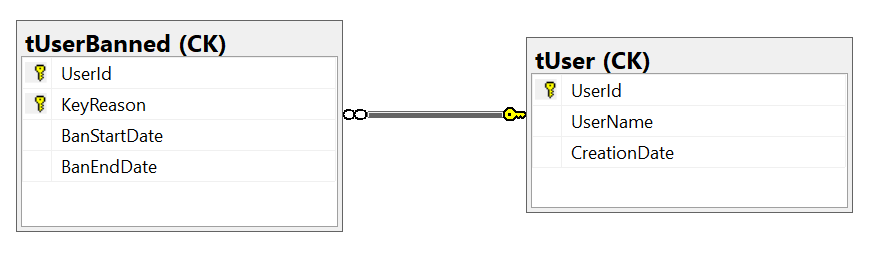

# CK.DB.User.UserBanned

This package is based on **CK.DB.Auth** that introduces User and authentication.

It adds UserBanned to the picture: An user present in the UserBanned table was banned.

The relational model of this package is as follows:



A user banishment can be set and destroy thanks to the `UserBannedTable` methods:

```csharp
/// <summary>
/// Create or update a user banishment between the specified dates.<br/>
/// If <paramref name="banStartDate"/> is <see langword="null"/> and the user is alerady ban then the start date will be the same, else it will be utc now.<br/>
/// If <paramref name="banEndDate"/> is <see langword="null"/> it will be eternal (9999-12-31).<br/>
/// </summary>
/// <param name="ctx">The call context.</param>
/// <param name="actorId">The identifier of the actor who bans the user.</param>
/// <param name="userId">The identifier of the user to ban.</param>
/// <param name="reason">The reason of the banishment.</param>
/// <param name="banStartDate">The start date of the banishment, default is utc now.</param>
/// <param name="banEndDate">The end date of the banishment, default is eternal.</param>
[SqlProcedure( "sUserBannedSet" )]
public abstract void SetUserBanned( ISqlCallContext ctx, int actorId, int userId, string reason, DateTime? banStartDate = null, DateTime? banEndDate = null );

/// <summary>
/// Destroy the user banishment.
/// </summary>
/// <param name="ctx">The call context.</param>
/// <param name="actorId">The identifier of the actor who destroy the banishment.</param>
/// <param name="userId">The identifier of the banned user.</param>
[SqlProcedure( "sUserBannedDestroy" )]
public abstract void DestroyUserBanned( ISqlCallContext ctx, int actorId, int userId );
```

This `CK.DB.User.UserBanned.Package` provides on override of the user destruction, it adds the deletion of the user in the tUserBanned table.<br/>

It also override the `CK.sAuthUserOnLogin` procedure from the CK.DB.Auth package. When a user tries to login, it check if the user is ban.

The sql view `CK.vUserBanned` provides the following values:
```sql
select UserId
      ,UserName
      ,BanStartDate
      ,BanEndDate
      ,IsBannedNow
      ,Reason
from CK.vUserBanned;
```
The value **IsBannedNow** is computed. It check at the execution of the view, if the current datetime is between BanStartDate and BanEndDate.
