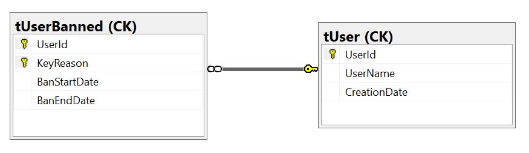

# CK-DB-User-UserBanned

This package is based on **CK.DB.Auth** that introduces User and authentication.

It adds UserBanned to the picture: a user present in the UserBanned table has been banned.

The relational model of this package is as follows:



The table tUserBanned accepts many bans for one user, with differents reasons. The unicity of a banishment is based on the couple (UserId, Reason).

A user banishment can be set and destroy thanks to the `UserBannedTable` methods:

```csharp
/// <summary>
/// Creates or updates a user banishment between the specified dates.
/// <para>
/// If <paramref name="banStartDate"/> is <see langword="null"/> and the user is already ban then the start date will be the same, else it will be utc now.
/// </para>
/// If <paramref name="banEndDate"/> is <see langword="null"/> it will be eternal (9999-12-31).
/// </summary>
/// <param name="ctx">The call context.</param>
/// <param name="actorId">The identifier of the actor who bans the user.</param>
/// <param name="keyReason">The reason of the banishment.</param>
/// <param name="userId">The identifier of the user to ban.</param>
/// <param name="banStartDate">The start date of the banishment, default is utc now.</param>
/// <param name="banEndDate">The end date of the banishment, default is eternal.</param>
[SqlProcedure( "sUserBannedSet" )]
public abstract void SetUserBanned( ISqlCallContext ctx, int actorId, string keyReason, int userId, DateTime? banStartDate = null, DateTime? banEndDate = null );

/// <summary>
/// Destroys the user banishment.
/// </summary>
/// <param name="ctx">The call context.</param>
/// <param name="actorId">The identifier of the actor who destroy the banishment.</param>
/// <param name="keyReason">The reason of the banishment.</param>
/// <param name="userId">The identifier of the user to unbanned.</param>
[SqlProcedure( "sUserBannedDestroy" )]
public abstract void DestroyUserBanned( ISqlCallContext ctx, int actorId, string keyReason, int userId );
```

This `CK.DB.User.UserBanned.Package` injects code into `CK.sAuthUserOnLogin` procedure (from the CK.DB.Auth package). To check the user is not currently banned.

The sql function `CK.fUserBannedViewAt` returns the effective banishments of the CK.tUserBanned table on the selected date.

The sql view `CK.vUserCurrentlyBanned` is based on the previous function and returns the following values for the banned users at the execution:
```sql
select UserId, KeyReason, UserName, BanStartDate, BanEndDate
from CK.vUserCurrentlyBanned;
```

## Test projects are not published

Both test projects of this repository declare `<IsPackable>false</IsPackable>`:

- `Tests/CK.DB.User.UserBanned.Tests`
- `Tests/CK.DB.User.UserPassword.Banned.Tests`

They used to be packable, following the `CK.DB.*.Tests` convention where a test package exposes reusable base
fixtures that a downstream repository inherits from — the way this repository itself consumes `CK.DB.Auth.Tests`
and `CK.DB.User.UserPassword.Tests`. Nothing consumes them that way today: the only reference to
`CK.DB.User.UserBanned.Tests` is the `ProjectReference` from `CK.DB.User.UserPassword.Banned.Tests`, inside this
repository. Publishing them would therefore mean maintaining a public surface with no consumer, so we stopped.

If a downstream repository ever needs to inherit these fixtures (for instance to derive from `UserBannedTests` and
set `AssumeNotSystemCanBan`, which exists precisely for that purpose), set `IsPackable` back to `true` in the
relevant project. Nothing else is required — keep in mind that doing so turns the test classes into a published
API, and renaming or reordering them then becomes a breaking change for the consumers.
